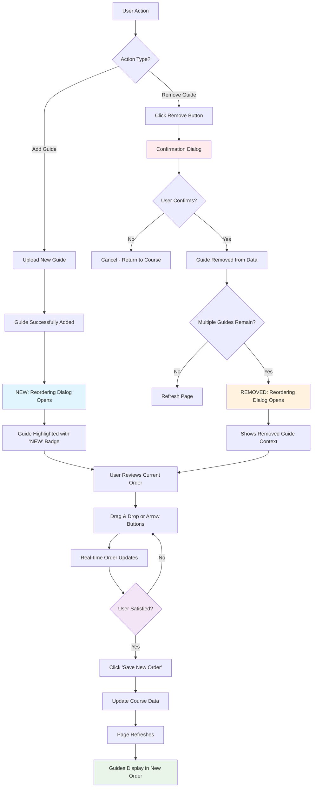

# Lesson Reordering Flow - Implementation Guide

## Overview

A comprehensive lesson reordering flow has been implemented that automatically triggers after adding OR removing guides from a course. This ensures that lessons maintain proper pedagogical sequence and gives users control over the teaching order in both scenarios.

## Features Implemented

### 1. **Automatic Reordering Trigger**
- **After Adding**: After successfully uploading a new guide, instead of immediately refreshing the page, a reordering dialog is presented
- **After Removing**: After confirming guide removal (if multiple guides remain), a reordering dialog appears
- Users can review and adjust the lesson sequence before finalizing any changes
- The newly added guide is highlighted with a "NEW" badge for easy identification
- Removed guide context is clearly communicated in the dialog

### 2. **Interactive Reordering Interface**
- **Drag and Drop**: Users can drag guides up or down to reorder them
- **Button Controls**: Arrow buttons provide an alternative to dragging for precise control
- **Visual Feedback**: 
  - Lesson numbers are displayed as circular badges
  - Guide status indicators show approval state
  - The newly added guide is highlighted with a different background color
- **Real-time Updates**: Order changes are reflected immediately in the interface

### 3. **Enhanced Data Structure**
- Added `order` field to guide objects in the Course interface
- Existing guides have been updated with order values
- Fallback logic ensures backward compatibility for guides without order values

### 4. **Improved Guide Display**
- Guides are now displayed with lesson numbers (e.g., "Lesson 1: Addition Concepts")
- Visual lesson number badges help users understand the current sequence
- Guides are automatically sorted by order field when displayed

### 5. **Guide Removal System**
- **Remove Button**: Each guide card includes a "Remove" button for easy access
- **Confirmation Dialog**: Double-confirmation prevents accidental deletions
- **Impact Warning**: Clear messaging about permanence and lesson order impact
- **Smart Reordering**: Automatically triggers reordering only when multiple guides remain
- **Context Preservation**: Removed guide title is shown in reordering dialog for context

## User Flow

### Standard Guide Upload Flow:
1. User clicks "Upload New Guide" 
2. Completes the multi-step upload form
3. **NEW**: Instead of page refresh, reordering dialog appears
4. User reviews the current lesson order with the new guide highlighted
5. User can drag guides or use arrow buttons to adjust order
6. User clicks "Save New Order" to confirm changes
7. Page refreshes to show the guides in their new order

### First-Time Upload Flow:
1. User uploads the first guide for a course
2. If multiple guides are expected for the course, reordering dialog appears
3. User can set the initial order for future guide planning

### Guide Removal Flow:
1. User clicks "Remove" button on any guide card
2. **Confirmation Dialog** appears asking to confirm the removal
3. Warning about permanence and impact on lesson order
4. User confirms removal
5. **NEW**: If multiple guides remain, reordering dialog appears 
6. User reviews updated lesson sequence and fills any gaps
7. User can reorder remaining guides to maintain logical flow
8. User clicks "Save New Order" to confirm changes
9. Page refreshes to show guides in their new order

## Technical Implementation

### Components Added:
- **`LessonReorderDialog`**: Main reordering interface component
- **Enhanced Course Detail Page**: Integrated reordering trigger and handler

### Key Features:
- **Drag and Drop Logic**: HTML5 drag API with visual feedback
- **Order Management**: Automatic order field updates and persistence
- **Visual Design**: Material-UI components with custom styling
- **State Management**: React hooks for dialog state and guide order

### Data Changes:
```typescript
// Updated Course interface
teacherGuides: {
  guides?: {
    id: string;
    title: string;
    status: string;
    order?: number; // NEW: Order field for sequencing
  }[];
}
```

## Benefits

### For Educators:
- **Logical Sequence**: Ensures lessons flow in pedagogical order
- **Flexibility**: Easy to adjust order as curriculum needs change
- **Visual Clarity**: Clear lesson numbering and status indicators

### For Course Administrators:
- **Quality Control**: Review opportunity before finalizing guide additions or removals
- **Consistency**: Standardized approach to lesson ordering across courses
- **User Experience**: Smooth, guided workflow for content management
- **Safe Operations**: Double confirmation prevents accidental content loss
- **Context Preservation**: Clear communication about what was removed and impact on remaining content

## Usage Examples

### Scenario 1: Adding a New Lesson
A teacher uploads "Lesson 3: Advanced Addition" to a course that already has:
1. Lesson 1: Basic Addition
2. Lesson 2: Simple Addition

The system shows all three lessons and allows the teacher to confirm that the new lesson should be in position 3, or move it to position 2 if it should come before "Simple Addition."

### Scenario 2: Reordering Existing Content
When adding "Introduction to Numbers" to a math course, the teacher realizes it should be the first lesson, not the last. They can drag it to position 1, and all other lessons automatically renumber.

## Complete Flow Diagram



## Future Enhancements

### Potential Improvements:
- **Bulk Reordering**: Allow reordering multiple guides at once
- **Template Ordering**: Save common lesson sequences as templates
- **Dependency Validation**: Check for prerequisite relationships between lessons
- **Auto-suggestions**: AI-powered suggestions for optimal lesson order

### Integration Opportunities:
- **Learning Path Integration**: Connect with broader curriculum planning tools
- **Analytics**: Track which lesson orders lead to better student outcomes
- **Collaboration**: Allow multiple educators to contribute to lesson ordering decisions

## Testing the Feature

### Test Scenarios:
1. **Upload New Guide**: Go to any course with existing guides and upload a new one
2. **Remove Guide**: Click remove button on any guide and confirm removal
3. **Reorder Lessons**: Use both drag-and-drop and button controls to test reordering
4. **Visual Feedback**: Observe highlighting of newly added guide and removal context
5. **Order Persistence**: Verify that saved changes persist after page refresh
6. **Edge Cases**: Test with single guide, no existing guides, and maximum guides
7. **Removal Edge Cases**: Test removing guides when only 1-2 guides remain

### Expected Behavior:
- Reordering dialog appears after successful guide upload or removal (if multiple remain)
- Confirmation dialog appears before guide removal with clear warnings
- Drag-and-drop works smoothly with visual feedback
- Order numbers update correctly when guides are moved
- Context about removed guide is clearly shown in reordering dialog
- "Save New Order" button is disabled until changes are made
- Page refreshes to show new order after saving
- Single remaining guides bypass reordering dialog

This implementation provides a comprehensive solution for managing lesson order while maintaining a smooth user experience and preserving data integrity. 